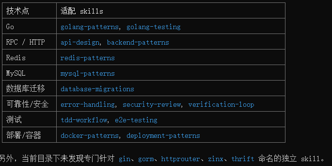
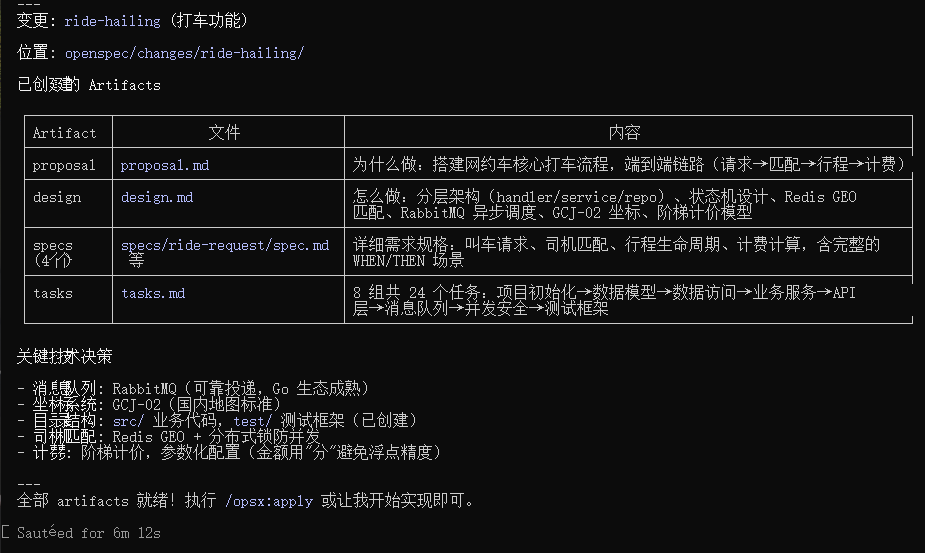
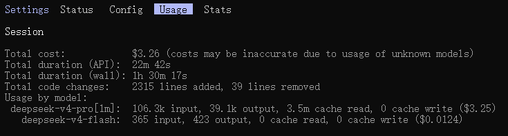
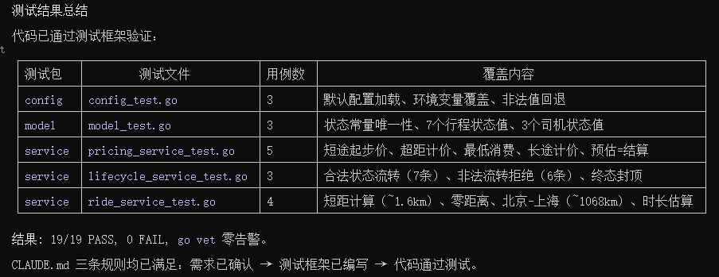

# 开发日记

## 2026-5-20
选取基本的辅助工具。首先选择open spec作为需求管理工具，再找开源的go语言skills。

根据文档安装openspec并初始化项目：https://github.com/Fission-AI/OpenSpec

我们使用copilot，从ecc里面搜罗一点skills。



直接copy到项目的/.claude/skills下，蛮方便，证明建立CC模板和远程Skills库的思路是正确的。

完善这些步骤之后，我们简单地写一点CLAUDE.md，限制CC的必须需求驱动、测试优先。

```
在编写代码之前，你必须理解需求、必须确保需求是经过用户确定的。

在编写代码之前，你必须确定已经根据需求编写了测试框架。

在编写代码之后，你一定要保证代码可以正常运行，并且通过测试框架。
```

我们不担心重构的问题，因为重构就是我们项目的一部分。我们直接开发打车这个核心功能试一试。

```
/openspec-propose "阅读项目readme.md文件，首先开发"打车"这个功能。"
```


因为我们是第一次提出需求，所以所有变更都存在了change文件夹下(猜的，后续改bug的时候可以确认这个观点是否正确)。下面我们直接实现这些tasks。
```
/openspec-apply-change
```

这一个需求的实现过程一共花费：


开发完了之后并未进行测试，我们手动进行测试：


我们在这个过程中并没有保证ai代码的可信度，因为我们是在用ai的代码验证ai的代码。我们今晚先不解决这个问题，搁置一下。我们来实现一个对解决这个问题起到辅助作用的工具，日志系统。

首先我们使用openspec指令进行需求初始化。
```
/openspec-propose "我们应该为项目开发一个日志系统，日志系统可以记录项目的重要行为。我们现在先在日志系统里实现对测试过程的日志记录，测  试的日志要记录测试的方法，测试的结果。此外，日志系统要保证模块化，因为我们以后可能还要添加对其它模块的日志记录。" 
```

```
在编写测试框架时，你要确定所有的测试行为都是为了对应的需求服务。在编写测试框架时，你要确定向用户详细说明测试代码的编写思路，在用户认可你的需求之后，你编写的测试框架才能落地使用。
```
是不是意味着我们可以使用sandbox进行开发？用户的反馈、测试框架的反馈是是否退出sandbox、退出sandbox时该采取什么行为的依据。总结来说，就是，被认可的才能被应用。
再进一步，根据开发等级，我们可以列举若干开发范式，最严格就是我们这种方式。最简单就是完全信任。
如果是新建的需求和实现，那么这种方法比较简单。如果是在现有代码的基础上进行修改怎么办？只能copy副本。

既然我们在写代码的时候要等待一会，那我们如何最大化利用我们的时间呢？
1. 其他项目
2. 同项目的其它需求